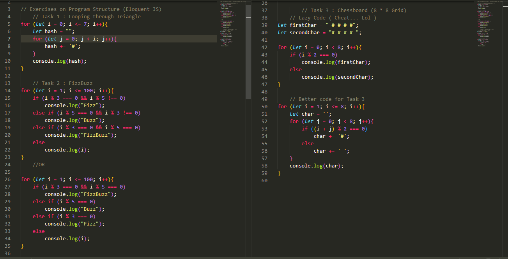

# My 100 Days of JS Experience

## Section
- [My 100 Days of JS Experience](#my-100-days-of-js-experience)
  - [Section](#section)
  - [Day 1 | June 13, 2023](#day-1--june-13-2023)
  - [Day 2 | June 14, 2023](#day-2--june-14-2023)
  - [Day 3 | June 15, 2023](#day-3--june-15-2023)
  - [Day 4 | June 16, 2023](#day-4--june-16-2023)
  - [Day 5 | June 17, 2023](#day-5--june-17-2023)
  

## Day 1 | June 13, 2023
- Read Program Structure on JS Eloquent
- Solve 5 problems on conditional statements and loop structures in JS
- I learnt Markdown in order to write a better readme file (I know it is not JS related)

> Quote of the Day : **_Taking the first step to do something is actually the hardest_**

[To get more info on Day 1 including resources](./Day_1/README.md)

## Day 2 | June 14, 2023

- Complete my reading on Program structure
- Solved 3 exercises on the topic


  
> Quote of the day: **_Scheduling a time in order to do something is the first step to fight against procrastination_**

[To get more info on Day 2 including resources](./Day_2/README.md)

## Day 3 | June 15, 2023
- Understood different kinds of Function in JS
  - Function Definition
  - Function Declaration
  - Arrow Function
  
> Quote of the day : **_"The more you learn, the more you realize how little you know"_**

[To get more info on Day 3](./Day_3/README.md)

## Day 4 | June 16, 2023

>I was sick

## Day 5 | June 17, 2023

- Read on Function
  - Closure
  - Recursive Function

```javascript
let square = function (num) {return num * num};

let sq = square;
console.log(sq(4)); // 16
```

```javascript
  /* Closure in JS */
let square = (num) => {return (n) => n * num};
let sq = square;

console.log(sq(3)(4)); // 12
```


> Quote of the day : **_"You don't always need an answer before you do what needs to be done"_**

[To get more info on Day 5](./Day_5/README.md)